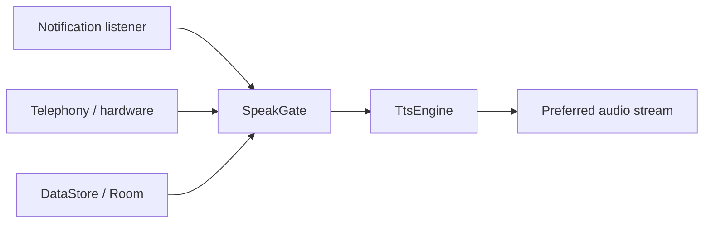

# Product Specification

> Spec-driven development for OpenShouter. Feature slices still use `docs/features/{name}.md`.
> Status markers: 🔲 open · ✅ done · ❌ blocked.

## Overview

**Product:** OpenShouter
**Purpose:** FOSS Android TTS announcer so people can hear chosen alerts without looking at the phone.
**Users:** People who cannot see or read a screen, and anyone who silences the device to check it less.

## Functional Requirements & User Stories

| ID | Story | Acceptance |
|----|-------|------------|
| FR-1 | As a user I hear chosen notifications spoken aloud | Per-app filters, format string, ignore/replace rules; unit tests in `examples/android/` |
| FR-2 | As a user I hear looping caller ID until I answer, reject, or miss | Telephony path without Play Services; no PII in logs |
| FR-3 | As a user I keep the phone silent unless I opt in | Speak-in-silent is off by default; DND counts as silent |
| FR-4 | As a user I stay FOSS | No Play Services, Firebase, Play Core, or closed telemetry (ADR-0002) |
| FR-5 | As a user I can silence competing OS and app dings | Silent pack + Welcome wizard; leak list opens channel settings; optional default-sound write |
## Non-Functional Constraints

- MIT license; GitHub Releases only
- No proprietary SDKs on the FOSS production path
- Opt-in telemetry only; never enabled by default
- File budgets: 300 lines static data, 150 lines pure logic (`ui/*/*.kt` is 300)
- Never log notification text, phone numbers, contact names, or coordinates
- Strings for Compose UI live in `res/values/strings.xml` only

## Architecture & Data Flow

## Test-first rule

Every feature in `docs/plan.md` / BUILD_PLAN must list tests, or state why automation is not feasible and name the fallback command.
